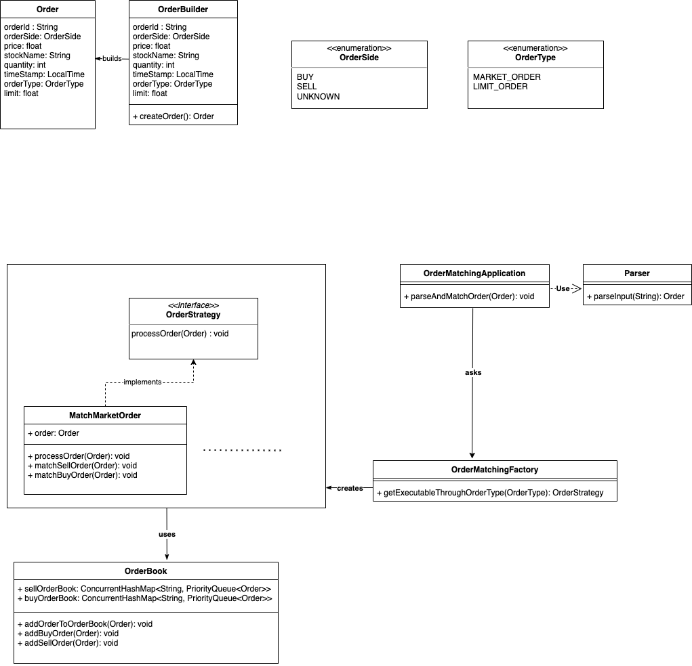

# Order Matching System #

`#JAVA`

Traders place Buy or Sell orders for a stock indicating the quantity and price.
These orders get entered into the exchange's order-book and remain there until they are matched or until the trading day ends.
The exchange follows a ` FirstInFirstOut Price-Time order-matching rule `, which states that: "The first order in the order-book at a price level is the first order matched. All orders at the same price level are filled according to time priority".
The exchange works like a market, lower selling prices and higher buying prices get priority.
A trade is executed when a buy price is greater than or equal to a sell price. The trade is recorded at the price of the sell order regardless of the price of the buy order.

# LLD: #
